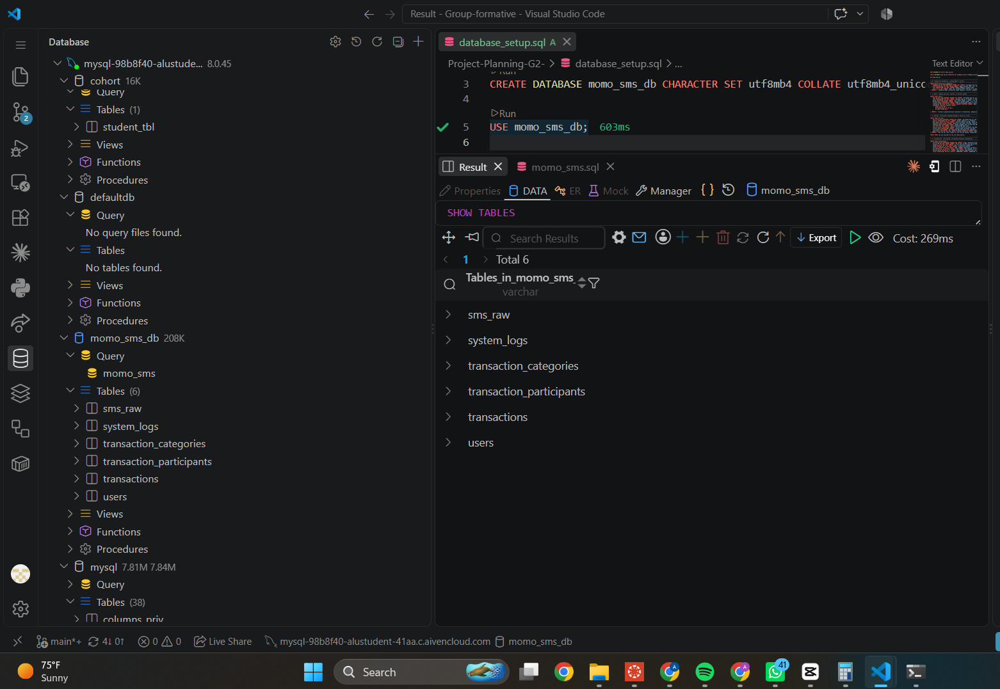
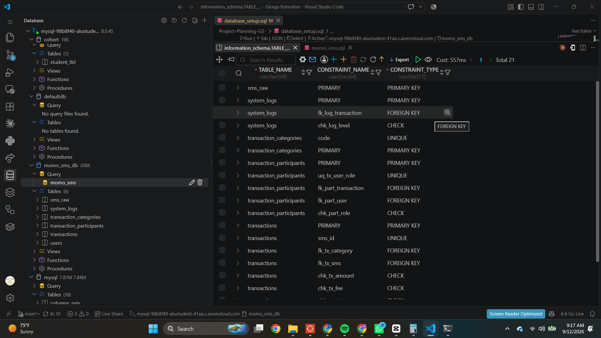
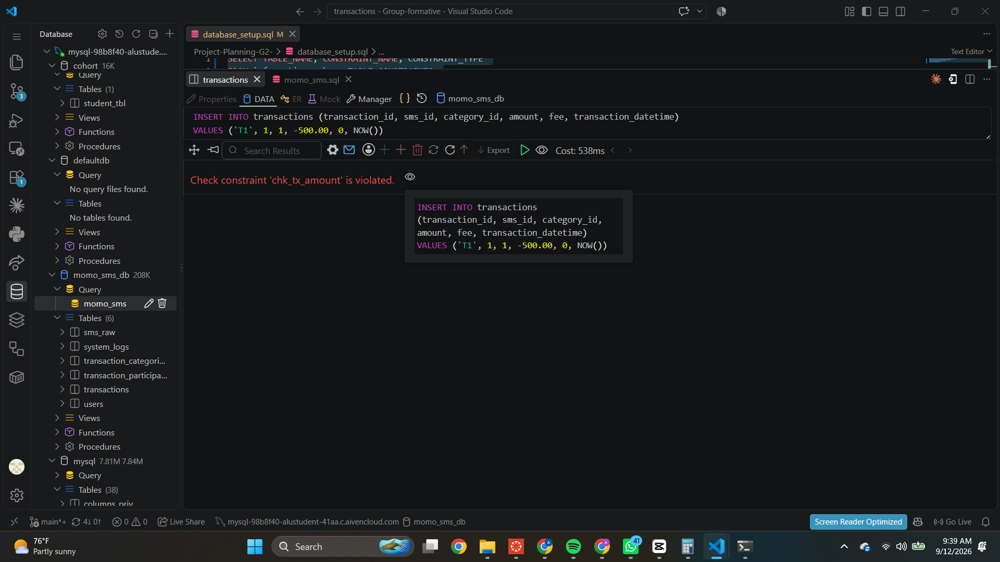
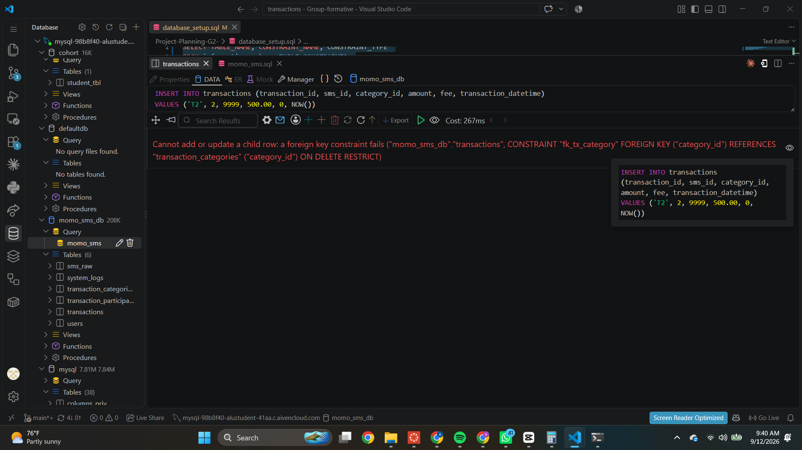
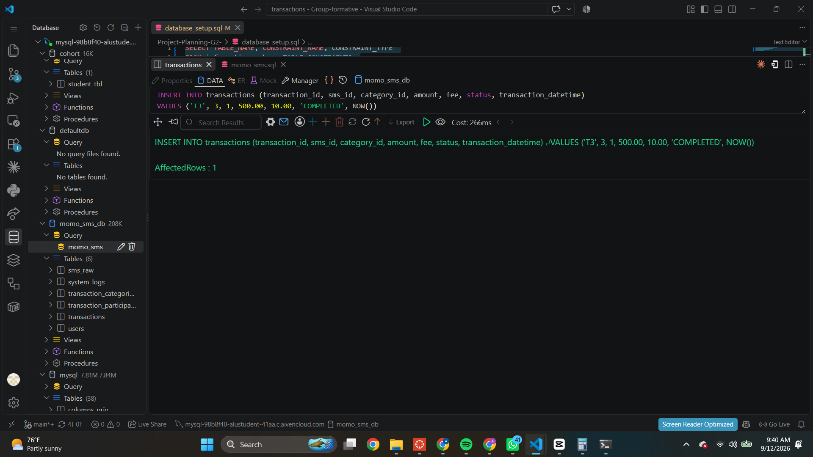

# SharijaVuba

SharijaVuba is a queue management platform for battery-swap riders and station attendants. It connects the rider experience, the station operations dashboard, and the backend systems that track queue events, notifications, and transaction activity.

## What this repository contains

The project is organised into a few clear parts:

- `rider-pwa`: the rider-facing web app for joining and tracking a queue.
- `station-dashboard`: the attendant dashboard used to manage queue flow and service actions.
- `backend-api`: the main API, queue logic, and event storage.
- `notification-lambda`: the AWS Lambda service responsible for notifications and communication events.
- `infra`: Terraform code for infrastructure provisioning.
- `docs/architecture`: architecture notes and design documentation.
- `ERD design file`: the MoMo XML data-model diagram that defines the event and transaction structure behind the platform.

## The MoMo data structure behind the system

The core data model in this project is built around incoming MoMo SMS messages and the way they are converted into meaningful payment and transaction events. The design is centered on these entities:

- `Users`: people who send, receive, or process money.
- `SMS_Raw`: the original inbound MoMo SMS messages before any parsing or validation.
- `Transactions`: the cleaned, structured financial records created from SMS data.
- `Transaction_Categories`: a lookup for transaction types such as deposits, transfers, payments, or airtime.
- `Transaction_Participants`: the relationship between transactions and users, including roles like sender or receiver.
- `System_Logs`: operational events such as OTPs, reversals, and other processing events.

In simple terms, the flow is:

Incoming MoMo SMS -> raw message capture -> transaction parsing -> categorisation -> participant mapping -> operational logging.

This creates a reliable foundation for tracking financial activity, queue-related events, and system operations in a structured way.

## Database Schema Validation

The schema (`database/database_setup.sql`) was implemented from the ERD above and tested against a live MySQL instance (Aiven Cloud, MySQL 8.0.45) before being handed off for sample data population.

### What was verified

1. **Script executes error-free** — all 6 tables (`sms_raw`, `system_logs`, `transaction_categories`, `transaction_participants`, `transactions`, `users`) create successfully in dependency order, with no FK or syntax errors.
2. **All constraints register correctly** — confirmed via `information_schema.TABLE_CONSTRAINTS`, showing 21 constraints across the 6 tables (6 PRIMARY KEYs, 3 UNIQUE constraints, 5 FOREIGN KEYs, and several CHECK constraints).
3. **CHECK constraints are enforced**, not just declared — a deliberate attempt to insert a negative transaction amount was rejected:
   > `Check constraint 'chk_tx_amount' is violated.`
4. **FOREIGN KEY constraints are enforced** — a deliberate attempt to insert a transaction referencing a nonexistent `category_id` was rejected:
   > `Cannot add or update a child row: a foreign key constraint fails ("momo_sms_db"."transactions", CONSTRAINT "fk_tx_category" FOREIGN KEY ("category_id") REFERENCES "transaction_categories" ("category_id") ON DELETE RESTRICT)`
5. **Valid CRUD operations succeed** — a correctly formed transaction insert was accepted and confirmed via `SELECT`.

All test rows were removed after verification so the database is clean for sample data population.

## JSON Data Modeling

The REST-style JSON representations, including a complete nested transaction
and the SQL-to-JSON mapping, are documented in
[docs/momo-json-data-modeling.md](docs/momo-json-data-modeling.md).

### Screenshots

**Tables created (`SHOW TABLES`)**


**Constraints registered (`information_schema.TABLE_CONSTRAINTS`)**


**CHECK constraint rejection**


**FOREIGN KEY constraint rejection**


**Valid insert + select**


## Local development

Prerequisites: Node.js 20+, Docker, and Terraform for infrastructure work.

```bash
npm install
docker compose up -d
npm run dev
```

## Links

- `High-Level System Architecture`: [Miro](https://miro.com/app/board/uXjVGA8fXmU=/?share_link_id=926089005134)
- `Board Setup`: [Trello](https://trello.com/invite/b/6a9bbeaa0d6c81f1fee0e953/ATTIaa8f1d3d5cd4f826621fe387297fb3d9D4FF2364/sharijavubabatteryqueue)
- `Database Design and Implementation (Activity 2)`: [Trello](https://trello.com/invite/b/6aa67b3e7312be360bcb591c/ATTIe64a0fac39602330823f04ffa85d4b4b40C76BB9/database-design-and-implementationg2)
- `Project Files and Assets`: [Google Drive](https://drive.google.com/file/d/1EixXPlCT5E-BhVtw5jWc8uf2n2ZKBZig/view?usp=sharing) — shared project documents, diagrams, and supporting materials

See each service folder's `package.json` and relevant configuration files for service-specific setup details.
